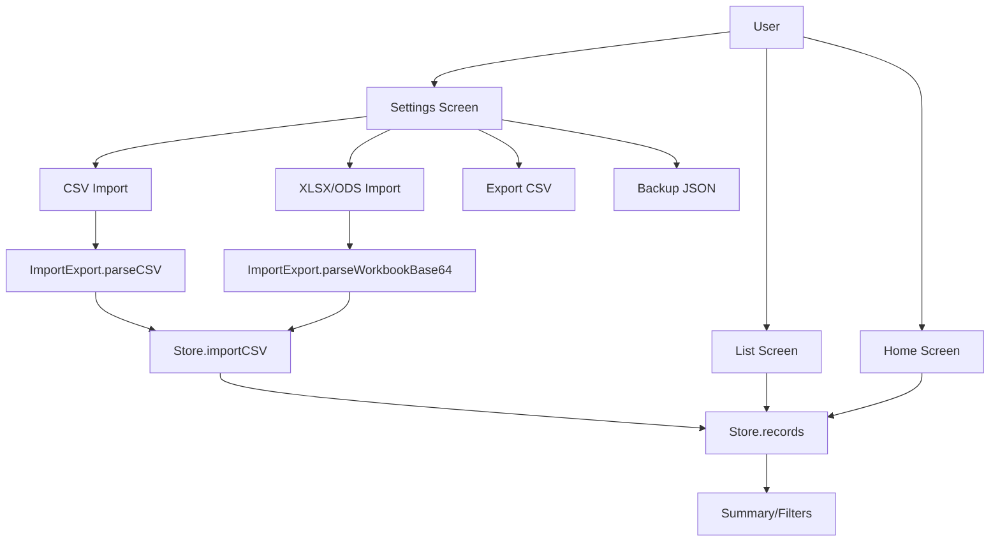
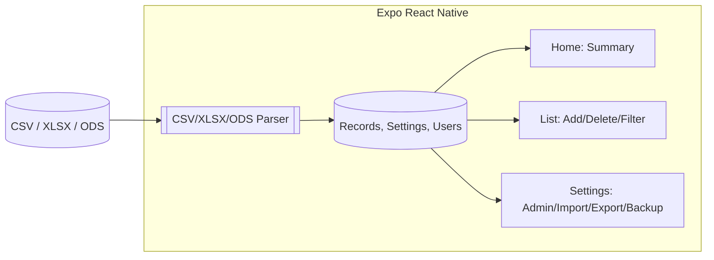

# System Architecture

## Modules
- Store: holds records and settings; provides list, summary, add, update, remove, import, export, backup
- ImportExport: parses CSV text and SheetJS workbooks (XLSX/ODS)
- Screens: Home (summary), List (CRUD), Settings (admin/import/export)

## Data Model
- Fields: expense_date, expense_description, expense_category, merchant_name, paid_through, income_amount, expense_amount, bal (derived)
- Sorting: date descending
- Filters: description, plus extensible to year/month/category/merchant/paid

## Tech Stack
- Expo React Native
- SheetJS `xlsx` for spreadsheets
- Expo Document Picker and File System

## Future Additions
- SQLite persistence (expo-sqlite)
- Charts and PDF report generation
- Secure settings and file sharing
