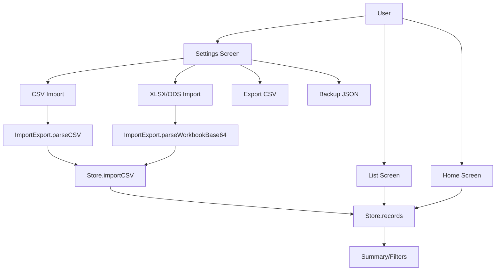
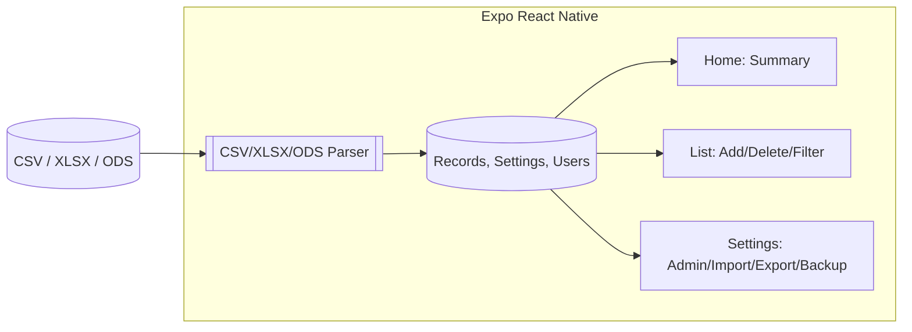
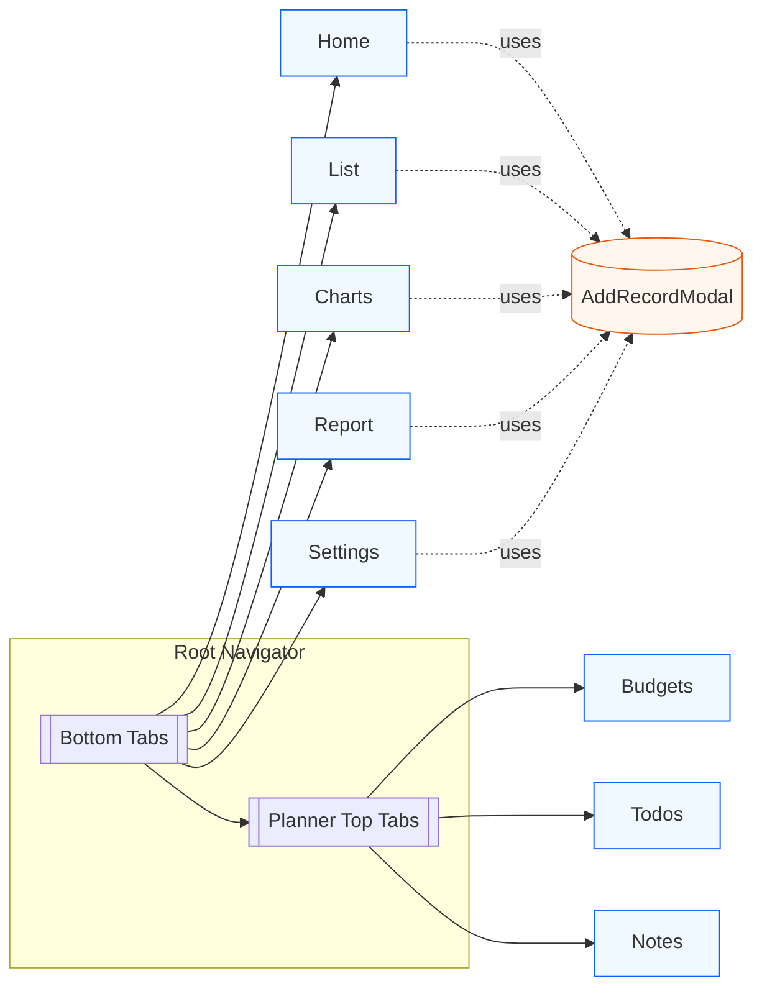
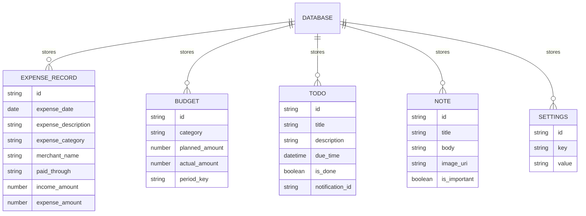
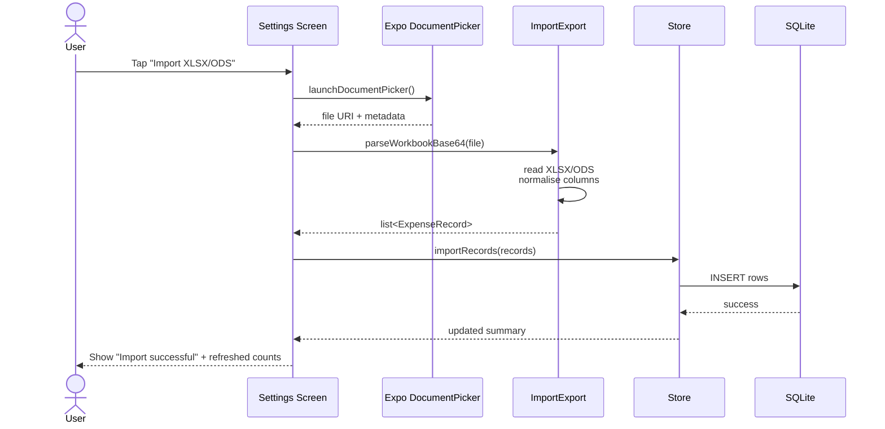
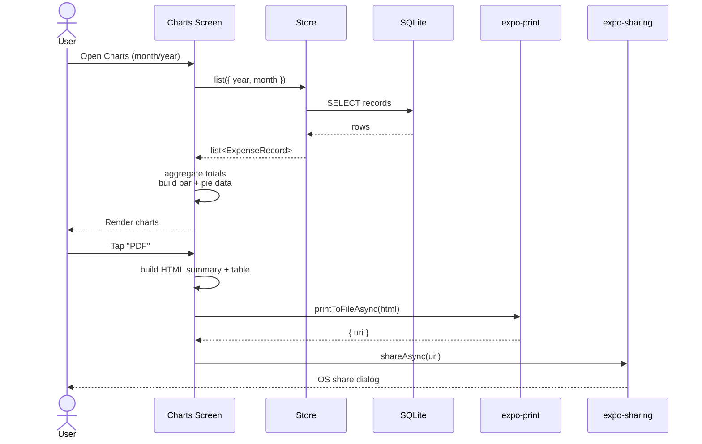
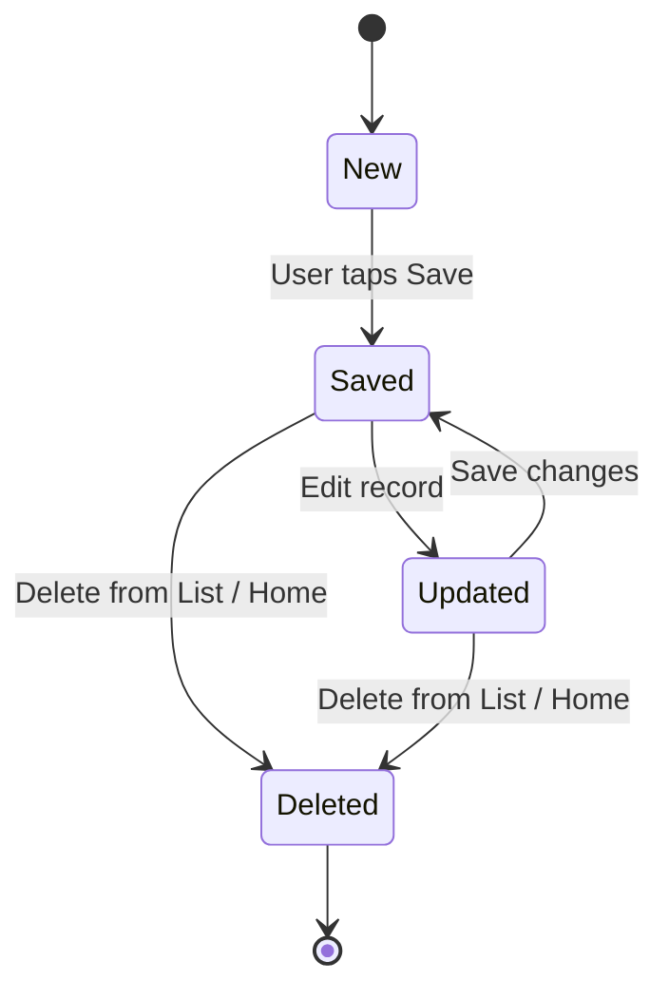
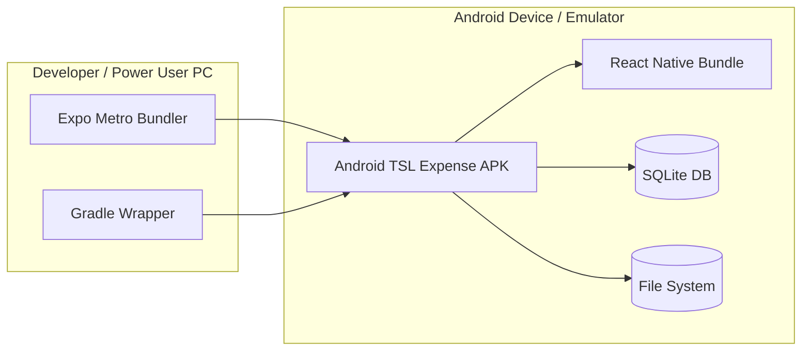

# System Architecture

## High‑Level Overview
Android TSL Expense is organised around a clean separation of concerns between data, import/export utilities, UI screens and the native Android layer. At the core sits the Store module, a TypeScript abstraction over a local SQLite database. It centralises all financial records, planner entities (budgets, todos, notes) and app settings (admin credentials, PDF options, recent databases, etc.). Every screen reads from and writes to the Store instead of talking to SQLite directly, which keeps persistence logic in one place and allows features like global refresh and cross‑screen updates.

The ImportExport module forms the bridge between external files and the Store. It uses SheetJS (`xlsx`) to parse XLSX, XLS and ODS spreadsheets and a custom CSV parser for pasted text. It normalises column names to the internal data model (date, description, category, merchant, paid through, income, expense) and returns a list of records ready to be imported. Settings and backup operations also route through this layer to produce CSV, Excel or JSON strings that can be saved or shared using Expo File System and Sharing.

On the UI side, the Expo React Native app is composed of several main screens: Home, List, Charts, Report, Settings and a Planner navigator. Home shows a dashboard view with current balance, quick stats and recent transactions. List provides full CRUD with advanced filters (year, month, category, merchant, paid through) and a global Add dialog that is accessible from the custom bottom tab bar. Settings hosts admin login, import/export/backup tools, logo configuration, PDF options (page size, signatures) and database management such as switching between recent files.

The Charts screen focuses on analytics. It queries the Store for a specific month/year and constructs two visualisations using `react-native-chart-kit`. The first is an Income vs Expense bar chart, showing high‑level cash flow. The second is a category‑wise donut/pie chart that breaks expenses down by category with colours, transaction counts and compact totals. Under the chart, a detailed list displays each category with an icon, number of transactions and formatted amount. Users can swipe months forward or backward and generate a PDF report of the analytics section using `expo-print` and `expo-sharing`, which renders HTML tables and summary metrics to a shareable document.

The Report screen focuses on tabular and printable summaries rather than interactive charts. It also integrates with PDF generation, allowing a more detailed, text‑oriented financial report across the selected period. Both Charts and Report rely on the same underlying Store queries, ensuring consistency between visual and textual analytics.

Planner mode introduces three additional entities: budgets, todos and notes. Budgets allow planning expected income and expenses per category; todos can have due times and native notifications via `expo-notifications`; notes can embed images stored as base64. These planner tables live in the same SQLite database but are accessed through dedicated planner screens grouped in a top‑tab navigator. This keeps financial tracking and daily planning in one app while still preserving a clear separation at the UI and data layer.

Navigation is powered by React Navigation with a custom bottom tab bar. A floating central button opens the AddRecordModal from anywhere, wired via a lightweight UI context so that screens do not need to manage modal state themselves. This design encourages quick capture of expenses or income without navigating back to a specific screen.

On the native side, the `rn-expo/android` Gradle project wraps the Java/Kotlin host app and bundles the React Native JS bundle using the Expo CLI (`@expo/cli`). Build scripts (`gradlew.bat assembleDebug` / `assembleRelease`) use configuration values from the top‑level Gradle files, including a pinned NDK version for compatibility with Expo modules such as SQLite and notifications. The Expo layer (managed from `rn-expo`) handles Metro bundling, Expo Go development, and native “run:android” builds. Together, the architecture balances ease of iteration via Expo with a stable, Gradle‑based production build pipeline.

## Modules
- Store: central data access for records, planner tables and settings (SQLite backed)
- ImportExport: parses CSV and spreadsheets (XLSX/XLS/ODS) and generates CSV/Excel/JSON
- Screens:
  - Home: dashboard and quick stats
  - List: CRUD + advanced filtering
  - Charts: bar and pie/donut charts with PDF export
  - Report: printable summaries and reports
  - Settings: admin, import/export/backup, logos, PDF and DB options
  - Planner: Budgets, Todos and Notes tabs

## Data Model
- Core fields: expense_date, expense_description, expense_category, merchant_name, paid_through, income_amount, expense_amount
- Derived: bal (running balance) and monthly totals
- Sorting: date descending by default
- Filters: description, year, month, category, merchant, paid_through

## Tech Stack
- Expo React Native with TypeScript
- SQLite persistence via `expo-sqlite`
- Charts using `react-native-chart-kit` and `react-native-svg`
- PDF and sharing via `expo-print` and `expo-sharing`
- File import via `expo-document-picker` and `expo-file-system`
- Notifications via `expo-notifications`

## Navigation Diagram

## Data Model Diagram

## Import XLSX Sequence

## Charts & PDF Sequence

## Record State Diagram

## Deployment Overview

